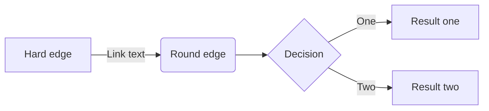

# Automation & bots

The conda-forge community is supported by a set of bots that automate many of the tasks that would otherwise be performed manually
by the core team or simply impossible to accomplish in a feasible time. This document provides a high level overview of the bot
ecosystem and how it works.

Due to the nature of the bots and the way they interact and manage the conda-forge infrastructure, we can subdivide the bots into
two categories:

- Core infrastructure
  - The auto-tick bot

- User facing bots
  - the web-services bot

## Core infrastructure: The auto-tick bot

Traditionally, updating the recipe on each release of a package has been the job of a group of recipe maintainers. Putting this
responsibility solely on recipe maintainers, however, results in some feedstocks being neglected and left outdated, as maintainers
may not remember to bump the feedstock version when a new version of the source code is released or may not even be aware of a
new version since in many cases recipe maintainers are not developers on the source code.

To solve this, the conda-forge “auto-tick”
bot was created to track out-of-date feedstocks and issue pull requests with updated recipes. Since then, the conda-forge ecosytem has grown
around automation and the “auto-tick” bot has become the core of the conda-forge infrastructure playing an important role in the automatic maintenance
of conda-forge packages, allowing the maintainers to build packages for different systems architectures ensuring a high level of quality.

### How it works

The bot tracks and updates out-of-date feedstocks in four steps:

- Find the names of all feedstocks on conda-forge.
- Compute the dependency graph of packages on conda-forge found in the previous step.
- Find the most recent version of each feedstock’s source code.
- Open a PR into each out-of-date feedstock updating the meta.yaml for the most recent upstream release.

Currently when a package passes by the auto tick bot, it’s information is processed and updated by calling some specific routines...

- Migrator: ??
- Update PR: Responsible for the creation/management of the PRs that will update the feedstock with the new version of the package or its build dependencies.
- Version acquisition: Its main goal is the requisition of every new version for the packages we currently have, getting this information using the sources that are provided for each package in our feedstock, and then load this information at the respective node inside our graph data structure
- Graph manipulation: This is the core of the bot, it is responsible for the creation of the graph data structure, the manipulation of the nodes and edges, and the PR history of each package as well as its metadata.

### Github Actions...

### Migrator

### Update PR

### Version acquisition

### Graph manipulation

## User facing bots: The web-services bot

### How to get help
